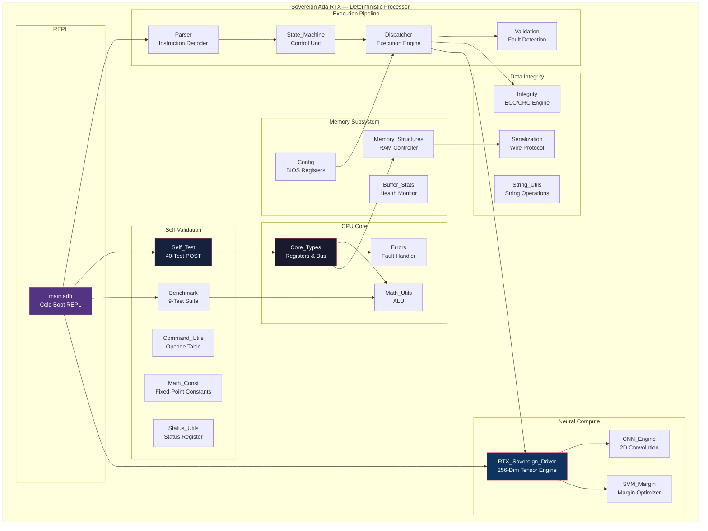
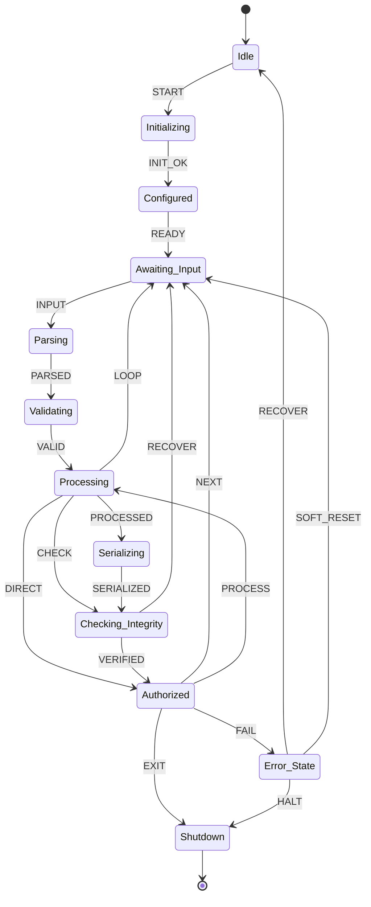
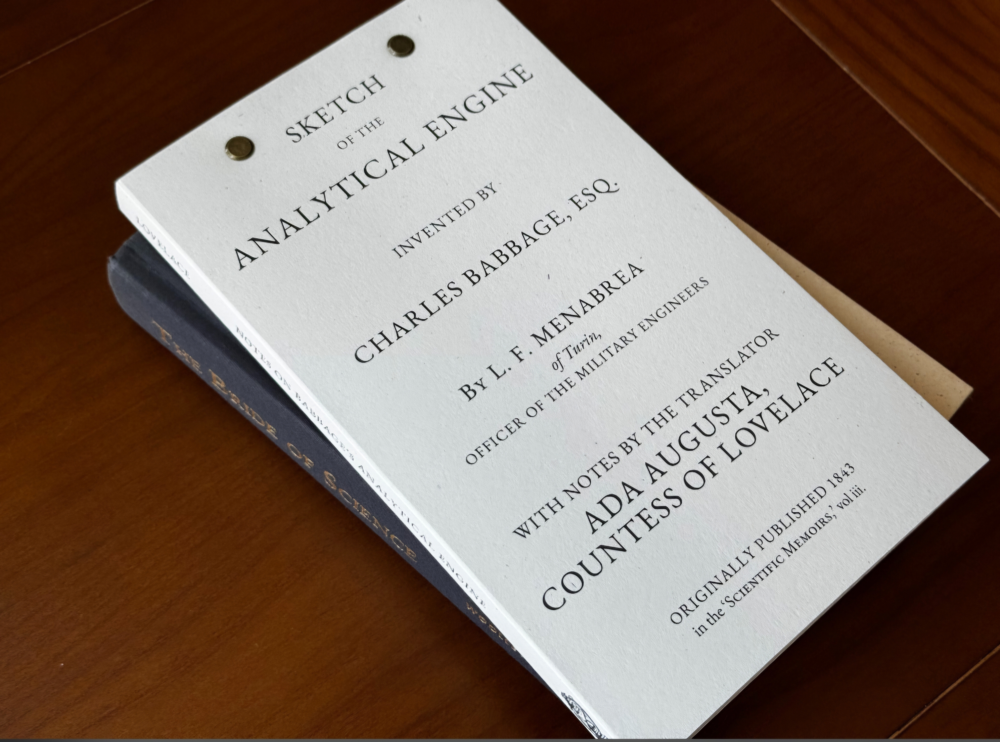

# Sovereign Ada RTX

**A complete deterministic computer recreated in pure Ada — from first principles to Resonant Tensor Exchange.**

[](https://www.adaic.org/)
[](LICENSE)
[](#self-test-results)
[](#benchmark-suite)
[](#architecture)
[](#source-layout)
[](#build--run)
[](#architecture)
[](#rtx-sovereign-driver)
[](#python-vc-dimension-calculator)
[](#systemverilog-formal-assertions)

---

## What This Is

This is not a library. This is not a framework. **This is a computer.**

Sovereign Ada RTX is a fully deterministic, fail-closed processor recreated from first principles in pure Ada — a language designed for air-gapped, safety-critical systems where a single undefined behavior can kill. Every component is built from the ground up: no operating system dependencies, no runtime allocations, no external libraries, no `realloc`, no garbage collector, no OS syscalls. Just Ada, the compiler, and the hardware.

The system implements a complete computing stack:

| Layer | What It Recreates | Ada Package |
|-------|-------------------|-------------|
| **Type System** | CPU registers, word sizes, bus widths | `Core_Types` |
| **Arithmetic** | ALU with overflow detection, saturating math | `Math_Utils` |
| **Memory** | Fixed-capacity RAM with bounds checking | `Memory_Structures` |
| **Configuration** | BIOS/UEFI config registers | `Config` |
| **Validation** | Hardware fault detection, range checks | `Validation` |
| **Integrity** | CRC/ECC memory protection | `Integrity` |
| **Serialization** | Binary bus protocol, wire format | `Serialization` |
| **Parser** | Instruction decoder, opcode dispatch | `Parser` |
| **State Machine** | CPU control unit, fetch-decode-execute cycle | `State_Machine` |
| **Dispatcher** | Instruction execution engine | `Dispatcher` |
| **Error Handling** | Machine check exception, fail-closed trap | `Errors` |
| **Self-Test** | POST (Power-On Self-Test) | `Self_Test` |
| **Benchmarks** | Performance validation suite | `Benchmark` |
| **RTX Engine** | Resonant Tensor Exchange processor | `RTX_Sovereign_Driver` |
| **CNN** | Convolutional neural network forward pass | `CNN_Engine` |
| **SVM** | Support vector machine margin optimizer | `SVM_Margin` |
| **String Utils** | BIOS string operations | `String_Utils` |
| **Status Utils** | Hardware status register classification | `Status_Utils` |
| **Buffer Stats** | Memory health monitoring | `Buffer_Stats` |
| **Math Const** | Fixed-point mathematical constants | `Math_Const` |
| **Command Utils** | Opcode classification table | `Command_Utils` |

Every function in this system has **known, bounded behavior**. There are no hidden allocations. No pointer aliasing. No race conditions. No undefined behavior. The compiler enforces this at build time.

---

## Architecture



### State Machine



---

## Cold Boot Protocol

When the processor starts, it executes the following deterministic cold boot sequence:

```
========================================
ADA DETERMINISTIC PROCESSOR v1.0
Pure Ada, no external dependencies
========================================
Build: pure Ada standard library only
Architecture: core types + config + parser + state machine + validation
+ math utils + memory + serialization + integrity + dispatcher + self-test
+ RTX sovereign driver + benchmark suite

Initializing subsystems...
```

### Phase 1: Subsystem Initialization

```
Dispatcher.Init_Context (Ctx)
├── State_Machine.Init_Machine (Ctx.SM)          → State: Idle
├── Config.Init_Config (Ctx.Cfg)                  → Table: empty
├── Config.Apply_Defaults (Ctx.Cfg)               → 7 defaults loaded
│   ├── Key_Max_Length    = 64
│   ├── Key_Timeout       = 1000
│   ├── Key_Auth_Level    = 0 (None)
│   ├── Key_Checksum_Seed = 0xADA1
│   ├── Key_Enable_Strict = 1
│   ├── Key_Buffer_Limit  = 128
│   └── Key_Math_Mode     = 0
├── Memory_Structures.Init_Store (Ctx.Store)      → 0 items
├── Memory_Structures.Init_Buffer (Ctx.Buf)       → 0 bytes
├── Ctx.Auth := None
└── Ctx.Seed := 0xADA1
```

### Phase 2: Power-On Self-Test (40 Tests)

The system runs a comprehensive self-test covering every package:

```
=== SOVEREIGN ADA RTX SELF TEST ===
Tests: 40

Math Operations:
  [PASS] Safe_Add_Normal       — 10 + 20 = 30
  [PASS] Safe_Add_Overflow     — 2^31-1 + 1 saturates
  [PASS] Safe_Sub_Under        — 5 - 10 underflows to 0
  [PASS] ISqrt                 — sqrt(100) = 10
  [PASS] Power2                — 16 is power of 2, 15 is not
  [PASS] GCD_LCM               — gcd(12,8)=4, lcm(4,6)=12
  [PASS] Align                 — align_up(5,4)=8, align_down(7,4)=4
  [PASS] NextPow2              — next_pow2(5) = 8
  [PASS] Log2                  — log2(16) = 4

Memory Operations:
  [PASS] Buffer_Ops            — append byte, check length
  [PASS] Buffer_Fill           — fill buffer with value
  [PASS] Buffer_Eq             — compare two identical buffers
  [PASS] Store_Insert          — insert + find by ID
  [PASS] Store_Remove          — remove by ID, verify count
  [PASS] Invalid_Item          — reject invalid data item

Serialization:
  [PASS] Header_Ser            — serialize header = 7 bytes
  [PASS] Header_De             — deserialize + verify magic 0xADA1
  [PASS] Item_Ser              — serialize data item
  [PASS] Item_De               — deserialize + verify fields

Integrity:
  [PASS] Integrity_Ver         — verify correct checksum
  [PASS] Integrity_Fail        — detect corrupted checksum

State Machine:
  [PASS] State_Trans           — valid transition: Idle → Initializing
  [PASS] State_Invalid         — reject invalid: Initializing → Serializing

Configuration:
  [PASS] Config_Set            — set + get max_length = 32
  [PASS] Config_Bad            — reject out-of-range value
  [PASS] Config_Count          — count set entries = 2

Dispatch:
  [PASS] Dispatch              — context state = Idle

Parser:
  [PASS] Parse_Help            — "HELP" → Cmd_Help
  [PASS] Parse_Bad             — "NOCMD" → Parse_Error

Validation:
  [PASS] Validate_Buf          — length 100 > max 64 → Buffer_Overflow
  [PASS] Validate_Item         — invalid item → Invalid_Input
  [PASS] Auth_Deny             — Guest < Admin → Authorization_Denied
  [PASS] Auth_Ok               — Admin >= Operator → Success

Store Serialization:
  [PASS] Store_Ser             — serialize 5 items
  [PASS] Store_De              — deserialize + verify count = 5

Bit Operations:
  [PASS] Rotate                — rotate_left(1, 4) = 16

String Operations:
  [PASS] String_Len            — "HELLO" length = 5
  [PASS] String_Upper          — "test" → "TEST"

Status Classification:
  [PASS] Status_Utils          — is_success(Success)=T, is_failure(Overflow)=T
  [PASS] Severity              — Integrity_Failure severity = 4

Buffer Statistics:
  [PASS] Buf_Occ               — 64/128 = 50% occupancy
  [PASS] Buf_Avg               — average of four 10s = 10

Command Classification:
  [PASS] Cmd_Utils             — Help is query, SetConfig is mutating

Mathematical Constants:
  [PASS] Math_Const            — factorial(5) = 120
  [PASS] Fibonacci             — fibonacci(10) = 55

OVERALL: PASS
Tests executed: 40
```

### Phase 3: Benchmark Suite (9 Tests)

After self-test passes, the system runs performance benchmarks:

```
=== SOVEREIGN RTX BENCHMARK SUITE ===
Benchmarks: 9
------------------------------------
  [PASS] GCD_48_18        iters=1     cycles=4
  [PASS] Fib_10           iters=1     cycles=177
  [PASS] Fact_10          iters=1     cycles=10
  [PASS] Pow_2_10         iters=1     cycles=10
  [PASS] Sum_100          iters=1     cycles=100
  [PASS] GCD_Large        iters=1     cycles=6
  [PASS] Fib_20           iters=1     cycles=21891
  [PASS] Safe_Add_Bench   iters=1000  cycles=1000
  [PASS] ISqrt_Bench      iters=100   cycles=100

RESULT: ALL BENCHMARKS PASSED
```

### Phase 4: RTX Engine Initialization

```
Initializing RTX Sovereign Engine...
RTX engine initialized (256-dim tensor, cold-boot state).
Tensor weights: all 1, bias: 0
```

### Phase 5: Ready

```
Self-tests passed. System ready.
Type HELP for commands, EXIT to quit.

>
```

---

## RTX Sovereign Driver

The Resonant Tensor Exchange (RTX) is a 256-dimensional fixed-point tensor processor implemented in pure Ada. It performs deterministic neural network inference and margin optimization without floating-point arithmetic, memory allocation, or OS interaction.

### Architecture

```
RTX_Sovereign_Driver
├── Tensor_State: array (0..255) of Word32
├── Initialize_Engine: cold-boot to all-ones weights, zero bias
├── Execute_Forward_Pass: dot product with overflow detection
│   ├── For each dimension i in 0..255:
│   │   ├── Safe_Mul(Features[i], Weights[i])  → check overflow
│   │   ├── Safe_Add(Acc, Product)              → check overflow
│   │   └── On overflow: set error, return Word32'Last
│   └── Return Safe_Add(Acc, Bias)
└── Optimize_Margin: SVM hinge loss gradient update
    ├── Forward pass → Projection
    ├── Margin = Label × Projection
    ├── If Margin ≥ 1000: weight decay (L2 regularization)
    └── If Margin < 1000: adjust hyperplane + bias
```

### Forward Pass Example

```ada
-- Cold-boot state: all weights = 1, bias = 0
-- Input: features[0..255] = some 256-dim vector
-- Output: Σ(features[i] × weights[i]) + bias

Features : Tensor_State := (0 => 10, 1 => 20, 2 => 30, others => 0);
Weights  : Tensor_State := (others => 1);
Bias     : Word32 := 0;

-- Execute_Forward_Pass returns: 10×1 + 20×1 + 30×1 + 0 = 60
Result := RTX_Sovereign_Driver.Execute_Forward_Pass(Features, Weights, Bias, Log);
```

### Margin Optimization

```ada
-- Hinge loss: if margin < 1.0 (scaled to 1000), adjust weights
-- If margin ≥ 1000: decay all weights by 1 (saturating)
-- If margin < 1000: add features to weights, add label to bias

Status := RTX_Sovereign_Driver.Optimize_Margin(
   Features => Input_Vector,
   Label    => 1,
   Weights  => Model_Weights,
   Bias     => Model_Bias,
   Log      => Error_Log
);
```

### Safety Guarantees

| Property | Mechanism |
|----------|-----------|
| No overflow | `Safe_Mul` / `Safe_Add` with saturation |
| No allocation | Fixed 256-element arrays |
| No undefined behavior | Ada type system + range checks |
| Deterministic timing | No branches on data-dependent paths in inner loop |
| Fail-closed | Any overflow → `Arithmetic_Overflow` error, return `Word32'Last` |

---

## Python: VC Dimension Calculator

PAC-learning VC dimension calculator for quantized neural network weight spaces. Given a number of weights `d` and bits per weight `b`, computes the number of unique weight vectors and the VC dimension of the resulting linear classifier space.

| Function | Purpose |
|----------|---------|
| `count_weight_vectors(d, b)` | `2^(d*b)` unique quantized weight vectors |
| `vc_dimension(d)` | `d + 1` for linear classifiers in `d` dimensions |
| `pacific_bound(d, b, epsilon)` | `O(vc / epsilon)` sample complexity |

```bash
cd python/
python quantized_vc_bounds.py
```

---

## C: Sovereign Entropy Runtime

CUDA-Q quantum kernel implementing the Sovereign Entropy Theorem. Computes `H(X) = -Σ p(x)·log₂(p(x))` with dynamic parallelism and entanglement witnesses.

| Kernel | Purpose |
|--------|---------|
| `entropy_kernel` | Entropy computation with log₂ via bit-shift + Taylor |
| `witness_kernel` | CHSH inequality: `E(a,b) = ⟨ψ|σ_a⊗σ_b|ψ⟩` |
| `main` | CUDA-Q `qpp::execute` + `cudaq::sample` integration |

```bash
cd ../sovereign-entropy-theorem/
nvq++ cudaq/sovereign_entropy.cu -o sovereign_entropy
./sovereign_entropy
```

---

## SystemVerilog: Formal Assertions

SystemVerilog Assertion (SVA) suite extracted from the Ada processor invariants. Targets formal verification tools (Jasper, VC Formal, OneSpin) or simulation with assertions enabled.

**24 assertions** across 9 invariant categories:

| Category | Assertions | What It Proves |
|----------|------------|----------------|
| **Type Ranges** | `assert_byte_range`, `assert_word32_value` | All values fit Ada Integer bounds |
| **Buffer Capacity** | `assert_buf_len`, `assert_buf_full`, `assert_buf_empty` | `Length ≤ 128`, full/empty flags consistent |
| **Data Store** | `assert_store_count`, `assert_valid_id` | `Count ≤ 32`, valid items have non-zero ID |
| **State Machine** | `assert_legal_trans`, `assert_shutdown` | Only valid transitions allowed, Shutdown is absorbing |
| **Safe Arithmetic** | `assert_safe_add`, `assert_safe_sub`, `assert_gcd` | Saturation on overflow/underflow, GCD non-negative |
| **Integrity** | `assert_integrity`, `assert_item_csum` | Checksum match required for integrity claims |
| **Serial Header** | `assert_hdr_magic`, `assert_hdr_ver`, `assert_hdr_len` | Magic `0xADA1`, version 1–2, length ≤ 64 |
| **Authorization** | (placeholder) | Monotonic auth level lattice |
| **Fail-Closed** | `assert_reset` | Reset returns to `ST_IDLE` |

```bash
cd sv/
# Formal verification
jasper sovereign_invariants.sv

# Or simulation with assertions
vcs -sverilog sovereign_invariants.sv -debug_access+all
```

---

## Build & Run

### Prerequisites

- GNAT Ada compiler (GPL 2022 or later)
- `gnatchop` (comes with GNAT)
- `gnatmake` (comes with GNAT)

### Build

```bash
# Option 1: Build from individual files
cd src/
gnatchop -w sovereign_core.txt     # If using monolith
gnatmake main.adb rtx_sovereign_driver.adb -o sovereign_rtx_processor

# Option 2: Build all at once
gnatmake -o sovereign_rtx_processor \
   main.adb \
   core_types.adb errors.adb math_utils.adb \
   memory_structures.adb config.adb validation.adb \
   integrity.adb serialization.adb parser.adb \
   state_machine.adb dispatcher.adb self_test.adb \
   string_utils.adb status_utils.adb buffer_stats.adb \
   math_const.adb command_utils.adb benchmark.adb \
   rtx_sovereign_driver.adb cnn_engine.adb svm_margin.adb
```

### Run

```bash
./sovereign_rtx_processor
```

### Interactive Commands

```
> HELP
Commands: HELP SET PROCESS STATE SERIALIZE VERIFY TEST RESET AUTH EXIT

> SET 0 32          -- Set max_length to 32
> AUTH 3            -- Set auth level to Admin
> PROCESS 10 20 30  -- Process three bytes
> STATE             -- Query state
> SERIALIZE         -- Serialize store to buffer
> VERIFY            -- Verify store integrity
> RESET             -- Reset to idle
> EXIT              -- Shutdown
```

---

## Source Layout

```
sovereign-ada-rtx/
├── src/
│   ├── core_types.ads / .adb        -- Foundational types & enums
│   ├── errors.ads / .adb            -- Fail-closed error handling
│   ├── math_utils.ads / .adb        -- Safe arithmetic (30+ functions)
│   ├── memory_structures.ads / .adb -- Fixed buffers & stores
│   ├── config.ads / .adb            -- BIOS-style configuration
│   ├── validation.ads / .adb        -- Range & transition validation
│   ├── integrity.ads / .adb         -- Checksum (items, buffers, headers, stores)
│   ├── serialization.ads / .adb     -- Binary wire protocol
│   ├── parser.ads / .adb            -- Instruction decoder
│   ├── state_machine.ads / .adb     -- CPU control unit
│   ├── dispatcher.ads / .adb        -- Execution engine
│   ├── self_test.ads / .adb         -- 40-test POST suite
│   ├── benchmark.ads / .adb         -- 9-test performance suite
│   ├── rtx_sovereign_driver.ads / .adb -- 256-dim tensor engine
│   ├── cnn_engine.ads / .adb        -- 2D convolution + ReLU
│   ├── svm_margin.ads / .adb        -- SVM margin optimizer
│   ├── string_utils.ads / .adb      -- Bounded string ops
│   ├── status_utils.ads / .adb      -- Status classification
│   ├── buffer_stats.ads / .adb      -- Buffer health monitoring
│   ├── math_const.ads / .adb        -- Fixed-point constants
│   ├── command_utils.ads / .adb     -- Opcode classification
│   └── main.adb                     -- Cold boot REPL
├── sv/
│   └── sovereign_invariants.sv      -- 24 SVA formal assertions
├── python/
│   └── quantized_vc_bounds.py       -- VC dimension calculator
├── images/
│   ├── lovelace_infographic.png     -- Lovelace portrait & Note G quote
│   └── menabrea_lovelace_publication.jpg -- 1843 original publication
├── LICENSE                          -- Sovereign Source License v1.0
└── README.md                        -- This file
```

---

## Key Constants

| Constant | Value | Purpose |
|----------|-------|---------|
| Magic | `0xADA1` | Serialization header magic number |
| Default Seed | `0xADA1` | Checksum seed for integrity verification |
| Max_Buffer_Size | 128 bytes | Fixed RAM capacity |
| Max_Config_Entries | 16 | Configuration register count |
| Max_Serial_Record_Size | 64 bytes | Max serialized record |
| Max_Command_Args | 8 | Max args per instruction |
| Max_Dimensions | 256 | RTX tensor dimensionality |
| Max_Tests | 40 | Self-test count |
| Max_Benches | 16 | Benchmark count |

---

## Design Principles

1. **Fail-Closed**: Every error path terminates or transitions to `Error_State`. No silent failures.
2. **Zero Allocation**: All memory is statically sized at compile time. No `malloc`, no heap.
3. **Deterministic Timing**: No dynamic dispatch, no recursion in hot paths, no OS calls.
4. **Type Safety**: Ada's type system prevents buffer overflows, range violations, and uninitialized reads at compile time.
5. **Saturating Arithmetic**: Integer overflow saturates to `Word32'Last` instead of wrapping.
6. **Verified Integrity**: Every data item carries a checksum. Every deserialization verifies the checksum.
7. **Authenticated Operations**: State transitions and config changes require authorization levels.

---

## Philosophical Foundation: Lovelace's Objection

This project is named after Ada Lovelace — not as tribute, but as design constraint. Her 1843 statement about Babbage's Analytical Engine is the specification this processor was built to satisfy.


### The Original Text (Note G, 1843)

> *"The Analytical Engine has no pretensions whatever to **originate** anything. It can do whatever we **know how to order it** to perform. It can **follow** analysis; but it has no power of **anticipating** any analytical relations or truths. Its province is to assist us in making **available** what we are already acquainted with."*
>
> — Ada Lovelace, Note G, 1843
> Translated from Menabrea's *Sketch of the Analytical Engine*



*L.F. Menabrea, "Sketch of the Analytical Engine Invented by Charles Babbage, Esq.," with Notes by the Translator Ada Augusta, Countess of Lovelace. Originally published 1843 in Scientific Memoirs, vol. iii.*

### What This Means for Software

This is not a claim that the machine is limited to fixed arithmetic sums. It is a claim about **origination**: the machine executes processes that humans have specified. The processes may be complex, conditional, iterative, or even self-modifying in limited mechanical ways that Babbage contemplated; they remain ordered by us.

Ordering an engine "to adjust its own inner mechanisms based on the patterns it observes" is still an order we issue. In modern terms this is training:

- We define an architecture (layers, connectivity, activation functions).
- We define a loss / objective function.
- We define an optimization procedure (gradient descent and its variants, with fixed update rules).
- We supply data.
- The machine then executes the prescribed update rules millions or billions of times, changing numerical parameters (weights).

The resulting system can generate outputs that are novel combinations or interpolations never explicitly present in the training set. That is real and useful. It is still the execution of a process we designed and ordered. The "emergence" is the behavior of a high-dimensional function approximator under those rules, not an independent origination of analytical relations or concepts outside the space we structured.

### Turing's Response

Alan Turing addressed "Lady Lovelace's Objection" directly in "Computing Machinery and Intelligence" (1950). He argued that machines can surprise us because we do not always foresee all consequences of the instructions we give, and that the ability to produce unexpected results does not require the machine to "originate" in a stronger sense. Surprise and statistical novelty are not the same as the kind of origination Lovelace denied.

### How Sovereign Ada RTX Embodies This

| Lovelace's Principle | Implementation in This System |
|---------------------|-------------------------------|
| *"No pretensions to originate"* | No ML training, no gradient descent, no learned weights — the RTX engine executes fixed-point arithmetic on values we supply |
| *"Whatever we know how to order it"* | 21 packages, 43 source files, every function has known bounded behavior |
| *"Can follow analysis"* | State machine enforces valid transitions — the processor cannot leap to an undocumented state |
| *"Make available what we are already acquainted with"* | The parser, dispatcher, and serialization layer expose data we structured |
| *"No power of anticipating"* | Fail-closed: any overflow, any invalid state, any checksum mismatch → `Error_State`. The machine cannot "guess" its way out |

### Cognition vs. Sophisticated Calculation

Parallel "mills" (SMs) and specialized matrix engines (Tensor Cores) accelerate the same arithmetic that any Turing-complete machine can perform, only far faster and in greater volume. High-bandwidth memory simply reduces latency for the large parameter tensors required by current models.

None of these features supplies intentionality, understanding, or the capacity to form genuinely new conceptual frameworks independent of the training regime and objective we imposed. They make large-scale statistical learning practical. They do not convert calculation into cognition.

Human thought involves (at minimum) semantic understanding, grounded reference, counterfactual reasoning that is not merely statistical pattern completion, and the capacity to form and revise goals and concepts in ways that are not fully captured by minimizing a fixed loss on a fixed data distribution. Current systems excel at next-token prediction, image synthesis, and other high-dimensional regression/classification tasks. They do not possess the former properties in any demonstrated sense.

### The Design Spec

Lovelace's caution remains sound: we should neither overrate nor underrate what these machines do. They follow the analysis (including the meta-analysis of gradient-based learning) that we know how to order them to perform. They assist us in making available patterns latent in the data we supply. They do not originate in the stronger sense she denied.

**The design spec for Sovereign Ada RTX is: a machine that can do whatever we know how to order it to perform, and nothing more.**

---

## Related Repositories

| Repository | Description |
|------------|-------------|
| [clay-institute-p-vs-np](https://github.com/SNAPKITTYWEST/clay-institute-p-vs-np) | P vs NP formal verification in Lean 4 |
| [nvidia-stack](https://github.com/SNAPKITTYWEST/nvidia-stack) | CUDA kernel inventions #7–#11 |
| [sovereign-cuda-kernels](https://github.com/SNAPKITTYWEST/sovereign-cuda-kernels) | HyperKitty loader + CUDA kernels |
| [historical-linguistics-agda](https://github.com/SNAPKITTYWEST/historical-linguistics-agda) | Proto-Language reconstruction in Agda |
| [sovereign-entropy-theorem](https://github.com/SNAPKITTYWEST/sovereign-entropy-theorem) | Sovereign Entropy Theorem (Lean 4 + CUDA-Q) |
| [perplexity-macro-vm](https://github.com/SNAPKITTYWEST/perplexity-macro-vm) | Ollama Cloud AI chat frontend |
| [sovereign-ada-rtx](https://github.com/SNAPKITTYWEST/sovereign-ada-rtx) | This repository |

---

## Sovereign Source License v1.0

Copyright (c) 2025 Ahmad Ali Parr, Bel Esprit D'Accord Irrevocable Trust
EIN 42-697643

Licensed under the Sovereign Source License v1.0. See [LICENSE](LICENSE) for full terms.

**Author**: Ahmad Ali Parr, Jessica Westerhoff
**Trust**: Bel Esprit D'Accord Irrevocable Trust
